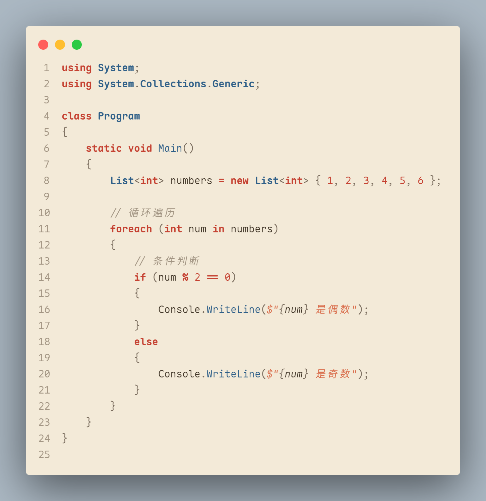
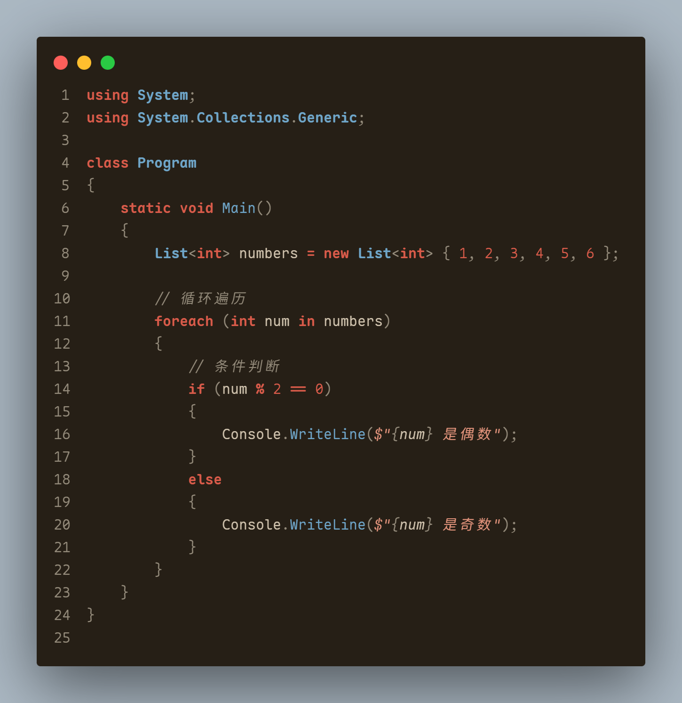

# 素缃 · Su Xiang

一本手抄旧书的颜色，落在你的代码上。


[](https://marketplace.visualstudio.com/items?itemName=Mosaulse.suxiang-theme)  

[](https://open-vsx.org/extension/Mosaulse/suxiang-theme)  


素缃 是一对从东方古籍美学中生长出来的 VSCode 颜色主题。
「素」是未经染色的生绢，素净安宁；「缃」是被岁月染成的浅黄，古卷扉页的颜色。
它没有刺眼的荧光白，也没有深不见底的黑。只有时间浸润后的温润纸色、沉淀下来的褪色墨迹、郑重落下的朱砂红印，以及青花瓷般沉静的靛蓝标题。仿佛在午后或者烛灯下摊开一本旧书，所有的代码都变得安静而有温度。

## 🏮 主题意境

### 素缃·朝霞（Suxiang - Light）
> 朝霞映窗，素缃初展。
> 宣纸如雪，墨迹如烟。

- **宣纸底色**：如初雪般纯净，似晨光般柔和
- **褪色墨迹**：经年累月，墨香犹存，字迹如诗
- **朱砂标题**：如印章落款，郑重其事，点睛之笔
- **靛蓝函数**：似青花瓷纹，清冷高雅，提纲挈领

### 素缃·暮色（Suxiang - Dark）
> 暮色四合，烛影摇红。
> 古卷泛黄，诗意渐浓。

- **深褐纸色**：如旧绢古卷，岁月沉淀，韵味悠长
- **浅金墨迹**：似金石文字，烛光映照，熠熠生辉
- **幽亮朱砂**：如暗夜明珠，幽然生光，意境深远
- **青花反光**：似瓷片流光，清冷分明，格调高雅

## 🎨 视觉预览

### 素缃·朝霞（Suxiang - Light）

> 晨起推窗，素缃初展。
> 朝霞映纸，墨香盈室。
> 关键字如朱砂印章，函数名似青花瓷纹。



### 素缃·暮色（Suxiang - Dark）

> 暮色苍茫，烛影摇红。
> 古卷泛黄，诗意流淌。
> 代码如诗，意境悠长。



## 🎨 四象配色

此主题遵循中国传统「四象」哲学，以四种古典意象构建色彩体系：

| 四象 | 朝霞色值 | 暮色色值 | 意象解读 | 在主题中的角色 |
|------|------------|------------|---------|---------------|
| **素绢**<br>（宣纸底色） | <span style="display:inline-block;width:16px;height:16px;border-radius:2px;background:#F3EAD8;border:1px solid #ddd;"></span> `#F3EAD8`<br><span style="display:inline-block;width:16px;height:16px;border-radius:2px;background:#E6DCC4;border:1px solid #ddd;"></span> `#E6DCC4` | <span style="display:inline-block;width:16px;height:16px;border-radius:2px;background:#261F16;border:1px solid #555;"></span> `#261F16`<br><span style="display:inline-block;width:16px;height:16px;border-radius:2px;background:#1F1912;border:1px solid #555;"></span> `#1F1912` | 如素绢铺展，似古卷泛黄 | 编辑器与侧边栏背景 |
| **墨迹**<br>（文字前景） | <span style="display:inline-block;width:16px;height:16px;border-radius:2px;background:#423729;border:1px solid #ddd;"></span> `#423729`<br><span style="display:inline-block;width:16px;height:16px;border-radius:2px;background:#7A6D5E;border:1px solid #ddd;"></span> `#7A6D5E` | <span style="display:inline-block;width:16px;height:16px;border-radius:2px;background:#D0C3AE;border:1px solid #555;"></span> `#D0C3AE`<br><span style="display:inline-block;width:16px;height:16px;border-radius:2px;background:#938A7A;border:1px solid #555;"></span> `#938A7A` | 经年墨香，字迹如诗 | 前景文字与注释 |
| **朱砂**<br>（关键字） | <span style="display:inline-block;width:16px;height:16px;border-radius:2px;background:#C54131;border:1px solid #ddd;"></span> `#C54131`<br><span style="display:inline-block;width:16px;height:16px;border-radius:2px;background:#D96C4A;border:1px solid #ddd;"></span> `#D96C4A` | <span style="display:inline-block;width:16px;height:16px;border-radius:2px;background:#D95B4A;border:1px solid #555;"></span> `#D95B4A`<br><span style="display:inline-block;width:16px;height:16px;border-radius:2px;background:#E3947C;border:1px solid #555;"></span> `#E3947C` | 印章落款，郑重其事 | 关键字、数字、状态栏 |
| **青花**<br>（函数类型） | <span style="display:inline-block;width:16px;height:16px;border-radius:2px;background:#2E5F88;border:1px solid #ddd;"></span> `#2E5F88`<br><span style="display:inline-block;width:16px;height:16px;border-radius:2px;background:#43769C;border:1px solid #ddd;"></span> `#43769C` | <span style="display:inline-block;width:16px;height:16px;border-radius:2px;background:#143252;border:1px solid #555;"></span> `#143252`<br><span style="display:inline-block;width:16px;height:16px;border-radius:2px;background:#6FA6C9;border:1px solid #555;"></span> `#6FA6C9` | 青花瓷纹，清冷高雅 | 标题栏、函数、类型名 |

**设计哲学：** 素绢为底，墨迹为文，朱砂断句，青花提纲。此乃书法之精神，亦是代码之美学。

## 📜 安装指南

> 素缃一卷，徐徐展开。
> 代码如诗，意境自来。

**方法一：VSCode 内安装**
1. 开启 VSCode，如开卷有益
2. 点击侧栏 **扩展** 图标（`Ctrl+Shift+X`）
3. 搜索 **Su Xiang** 或 **素缃**
4. 点击 **安装**，静待花开
5. 按下 `Ctrl+K Ctrl+T`（Mac: `Cmd+K Cmd+T`），选择 **素缃·朝霞** 或 **素缃·暮色**

**方法二：市场直装**
或直接从 [VSCode Marketplace](https://marketplace.visualstudio.com/) 寻得此卷。

## ⚙️ 雅致配置

> 工欲善其事，必先利其器。
> 配置得当，意境更浓。

为得最佳古典体验，建议在 `settings.json` 中添此配置：

```json
{
  "editor.fontFamily": "'Cascadia Code', 'Noto Serif CJK SC', 'Fira Code', monospace",
  "editor.fontSize": 15,
  "editor.lineHeight": 1.6,
  "editor.renderWhitespace": "selection",
  "editor.bracketPairColorization.enabled": true,
  "editor.guides.bracketPairs": true,
  "workbench.colorTheme": "素缃·朝霞"
}
```

> 🎋 **字体建议**：若选用带有传统衬线的 **Noto Serif CJK SC** 或 **Source Han Serif SC**，那一抹缃色的古意将更加浓烈，如诗如画。

## 📚 语言适配

> 素缃一卷，兼容万言。
> 无论何种语言，皆能诗意盎然。

此主题基于标准 TextMate 语义着色，万语千言皆能诗意呈现。特别适配之语言包括：

**前端三绝**：JavaScript · TypeScript · HTML/CSS
**后端雅言**：Python · Java · C# · Go · Rust
**数据之语**：SQL · JSON · Markdown
**系统之音**：C/C++ · Shell

> 🎨 无论何种编程语言，在素缃之中，皆能如诗如画，意境悠远。

## 🛠️ 本地研习

> 若欲深究此卷，可本地研习。
> 代码如诗，意境自得。

```bash
# 克隆此卷
git clone https://github.com/mosaulse/suxiang-theme.git
cd suxiang-theme

# 安装文房四宝（依赖工具）
npm install

# 开启 VSCode，按 F5 启动研习窗口
code .

# 打包成卷，以待流传
npx vsce package
```

## 🖋️ 共谱新章

> 素缃一卷，非一人之功。
> 愿与诸君，共谱新章。

此「素缃」主题，源于对「泛黄纸张与朱砂印章」的诗意想象。若觉某段语法高亮可更贴切，或欲增语言之精细支持，欢迎：

1. 提交 [Issue](https://github.com/mosaulse/suxiang-theme/issues)，述汝之思
2. 直接 Fork 此卷，提交 Pull Request，在 `tokenColors` 中添新作用域

> 🎨 颜色亦是文字，期待君为此卷素缃，染上新彩。

## 📓 版本纪事

### v1.0.1 - 2026-05-06

**意境优化**

- 优化编辑器选中背景色与高亮颜色，视觉效果更佳
- 调整标题栏配色方案，添加边框区分层次
- 新增调试状态栏配色，调试状态更清晰
- 新增无文件夹状态栏配色，界面状态分明
- 统一深浅主题配色体系，视觉体验更和谐

详见 [CHANGELOG.md](./CHANGELOG.md)

## 📜 许可声明

MIT License © Mosaulse

---

> 素缃一卷，墨香千年。
> 代码如诗，意境悠然。
> 愿君在代码世界里，常有一纸素缃相伴。

---

**诗词引用**：
- 《诗经》「素丝五紽」
- 《楚辞》「缃绮为下裙」
- 传统四象哲学
- 中国古典美学意象